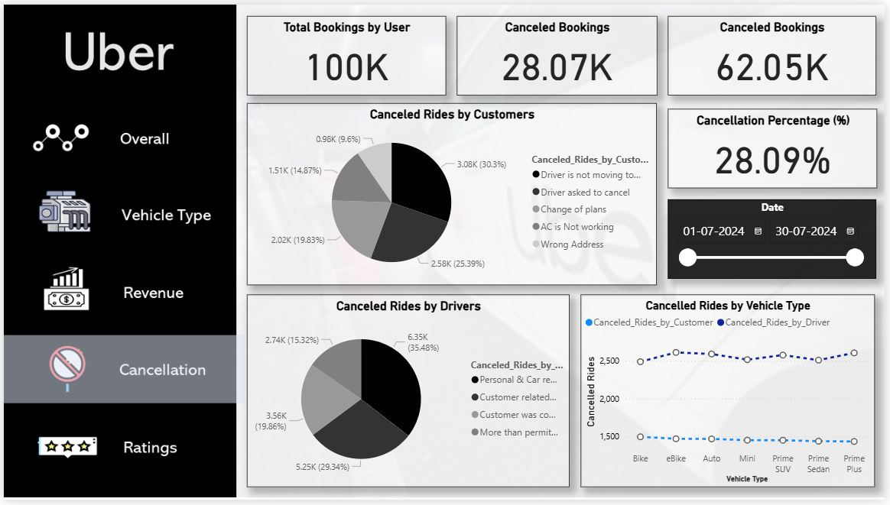

# UBER Ride Booking Data Analysis Project

This project analyses over **100,000 simulated UBER ride bookings** in Bengaluru to uncover booking trends, cancellations, customer behaviour, and revenue patterns.

## Project Objective
- Understand ride success rates, cancellations, and customer ratings
- Identify revenue patterns and peak demand periods

## Tools Used
- **SQL** — Data analysis and querying
- **Power BI** — Dashboard creation
- **Excel** — Data cleaning

## Key Insights
- **62% ride success rate**, with cancellations mostly due to driver or customer issues
- Bookings rise **~30% on weekends and match days**
- **Cash and UPI** are top payment methods
- Average customer and driver ratings are near **4.0**

## Final Analysis
- Analysed 100K+ UBER ride records using SQL & Power BI to identify booking success rate (62%), cancellation patterns (7% by customers, 18% by drivers), and peak demand periods
- Built 10+ SQL queries and 5+ Power BI dashboards to visualise booking trends, cancellation reasons, and customer-driver ratings.
- Derived insights on revenue impact of weekends & match days, highlighting up to 30% higher bookings during peak periods.
- Optimised reporting by creating SQL views for top customers, vehicle-wise ride distances, and incomplete ride reasons.

## Visualisations Preview

| Overall Bookings & Status | Vehicle-wise Analysis |
|:---:|:---:|
|  |  |

| Revenue Breakdown | Cancellation Analysis | Ratings Overview |
|:---:|:---:|:---:|
|  |  |  |

## Project STAR Summary

- **Situation:** UBER’s platform faces variable booking success and cancellations affecting revenue and service.
- **Task:** Analyse a dataset of **100K+ rides** to extract insights on booking trends, cancellations, and ratings.
- **Action:** Built SQL queries and Power BI dashboards for insights on bookings, customer ratings, cancellations, and revenue.
- **Result:** Provided actionable data visualisations revealing customer patterns, peak periods, and business insights.

---

For full SQL queries, dashboards, and insights — check the repository files.

---

## About Me

I’m **Aryaman Raj Tiwari**, a data analyst passionate about transforming data into actionable insights using **SQL**, **Power BI**, and **Excel**.

📫 **Contact Me:** [LinkedIn](https://www.linkedin.com/in/itsaryantiwari) | i.aryantiwari@gmail.com
